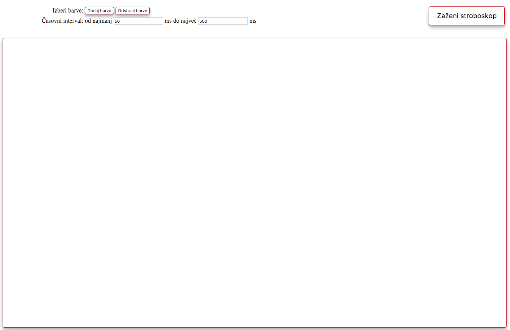

# Spletni barvni stroboskop

1\. domača naloga pri predmetu [Osnove informacijskih sistemov](https://ucilnica1516.fri.uni-lj.si/course/view.php?id=54) (navodila)

## Opis naloge in navodila

Na [GitHub](https://github.com) je na voljo javni repozitorij [https://github.com/lovre/stroboskop](https://github.com/lovre/stroboskop), ki vsebuje nedelujoč spletni stroboskop. V okviru domače naloge ustvarite kopijo repozitorija ter popravite in dopolnite obstoječo implementacijo spletne strani tako, da bo končna aplikacija z vsemi delujočimi funkcionalnostimi izgledala kot na sliki spodaj. 



Gumb _"Dodaj barvo"_ strani doda novo barvo, ki jo je moč kasneje spremeniti, dočim gumb _"Odstrani barve"_ odstrani vse obstoječe barve. Gumb _"Zaženi/Ustavi stroboskop"_ začne ali ustavi delovanje stroboskopa, ki zaporedoma prikazuje barve na strani. Čas prikaza posamezne barve je določen naključno iz izbranega časovnega intervala.

Domača naloga zahteva osnovno poznavanje GIT ukazov, HTML označb, CSS stilov in jezika JavaScript. Domača naloga ne zahteva veliko dela, a zahteva nekaj razmisleka. Pri delu __natančno sledite navodilom__!

###### Kako naj podam povezave?
Spletno povezavo na [GitHub](https://github.com) repozitorij podate kot `https://github.com/{študent}/stroboskop`, kjer _{študent}_ predstavlja [GitHub](https://github.com) uporabniško ime. Spletno povezavo na uveljavitev v [GitHub](https://github.com) repozitoriju podate kot `https://github.com/{študent}/stroboskop/compare/{commit}`, kjer je _{commit}_ identifikator uveljavitve. Le-tega pridobite na spletni strani [GitHub](https://github.com) repozitorija v zavihku _Commits_ pod _Code_, kjer je vsaki uveljavitvi pripisan SHA identifikator (uporabite možnost _Copy the full SHA_).

## I. Vzpostavitev okolja in repozitorija

1. Vzpostavite si repozitorija [GitHub](https://github.com) in [Bitbucket](https://bitbucket.org) ter razvojno okolje [Cloud9](https://c9.io).
Repozitorija [GitHub](https://github.com) in [Bitbucket](https://bitbucket.org) povežite z okoljem [Cloud9](https://c9.io) ter ustvarite zaslonski maski uporabniških nastavitev okolja [Cloud9](https://c9.io), ki prikazujeta uporabniško ime v okolju [Cloud9](https://c9.io) ter povezavo na repozitorija [GitHub](https://github.com) in [Bitbucket](https://bitbucket.org) skupaj s pripadajočimi uporabniškimi imeni.
	
	###### Kaj naj oddam?
	Dve [zaslonski maski](http://www.take-a-screenshot.org), ki prikazujeta tri uporabniška imena ter povezavi med razvojnim okoljem in repozitorijema.
	
	---
	
2. Na [GitHub](https://github.com) z uporabo funkcije _Fork_ ustvarite lastno kopijo javnega repozitorija [https://github.com/lovre/stroboskop](https://github.com/lovre/stroboskop) v okviru katere boste opravljali domačo nalogo. Kopija repozitorija naj ostane javna in naj ohrani ime _"stroboskop"_. 

	###### Kaj naj oddam?
	Spletno povezavo na ustvarjeno kopijo repozitorija [https://github.com/lovre/stroboskop](https://github.com/lovre/stroboskop).
	
	---

3. V razvojnem okolju [Cloud9](https://c9.io) uvozite pravkar ustvarjen [GitHub](https://github.com) repozitorij z uporabo funkcije _Clone to edit_ ter privzetimi nastavitvami. V repozitoriju posodobite vsebino Markdown datoteke _README.md_ tako, da bo vsebovala ta navodila domače naloge, ki so dostopna preko [eUcilnice](https://ucilnica.fri.uni-lj.si/course/view.php?id=54). Z uporabo GIT v ukazni lupini okolja [Cloud9](https://c9.io) spremembe najprej uveljavite v lokalnem repozitoriju s sporočilom _"Dodajanje navodil domače naloge"_, nato pa še v oddaljenem [GitHub](https://github.com) repozitoriju.

	###### Kaj naj oddam?
	Spletno povezavo na ustvarjen [GitHub](https://github.com) repozitorij in zaporedje GIT ukazov, ki ste jih uporabili v ukazni lupini razvojnega okolja.
	
	---

4. V repozitorij dodajte JavaScript knjižnico za izbiro barv _jscolor.js_, ki jo prenesite iz spletnega mesta [jscolor](http://jscolor.com), ter odstranite nepotrebno JavaScript knjižnico _nepotrebno.js_. Z uporabo GIT v ukazni lupini okolja [Cloud9](https://c9.io) spremembe uveljavite v lokalnem repozitoriju s sporočilom _"Priprava potrebnih JavaScript knjižnic"_, nato pa še v oddaljenem [GitHub](https://github.com) repozitoriju.

	###### Kaj naj oddam?
	Spletno povezavo na uveljavitev v [GitHub](https://github.com) repozitoriju iz katere so razvidne zahtevane spremembe.

## II. Skladnja strani in stilska preobrazba

1. Z uporabo GIT v ukazni lupini okolja [Cloud9](https://c9.io) ustvarite novo vejo _izgled_ ter razvoj nadaljujte v novi veji. V repozitoriju spletni strani _stroboskop.html_ dodajte povezavo na stilsko datoteko _stili.css_. Spremembe uveljavite v lokalnem repozitoriju s sporočilom _"Dodajanje stilov spletne strani"_ ter v oddaljenem [GitHub](https://github.com) repozitoriju.

	###### Kaj naj oddam?
	Spletno povezavo na uveljavitev v [GitHub](https://github.com) repozitoriju iz katere so razvidne zahtevane spremembe in zaporedje GIT ukazov, ki ste jih uporabili v ukazni lupini razvojnega okolja.
		
	---

2. V repozitoriju na spletni strani _stroboskop.html_ besedili _"Izberi barve:"_ in _"Časovni interval:"_ poravanjte desno kot je prikazano na podani sliki. Za to uporabite HTML atribut _style_ ustreznih elementov. Spremembe uveljavite v lokalnem repozitoriju s sporočilom _"Desna poravnava besedil"_ ter v oddaljenem [GitHub](https://github.com) repozitoriju.

	###### Kaj naj oddam?
	Spletno povezavo na uveljavitev v [GitHub](https://github.com) repozitoriju iz katere so razvidne zahtevane spremembe.

	---

3. V repozitoriju spletni strani _stroboskop.html_ dodajte gumb z napisom _"Odstrani barve"_ in HTML atributom _id_ enakim _"odstraniBarve"_. Novi gumb naj bo postavljen poleg gumba _"Dodaj barvo"_ kot je prikazano na podani sliki. Spremembe uveljavite v lokalnem repozitoriju s sporočilom _"Dodajanje gumba za odstranjevanje barv"_ ter v oddaljenem [GitHub](https://github.com) repozitoriju.

	###### Kaj naj oddam?
	Spletno povezavo na uveljavitev v [GitHub](https://github.com) repozitoriju iz katere so razvidne zahtevane spremembe in spletno povezavo oblike [https://rawgit.com/{študent}/stroboskop/izgled/stroboskop.html](https://rawgit.com/{študent}/stroboskop/izgled/stroboskop.html), kjer _{študent}_ predstavlja [GitHub](https://github.com) uporabniško ime.
	
	---
	
4. V repozitoriju vsem gumbom na spletni strani _stroboskop.html_ ter pa HTML elementu _telo_ dodajte rdeč rob in sivo senco kot je prikazano na podani sliki. V ta namen v stilski datoteki _stili.css_ najprej definirajte CSS selektorja _rob_ in _senca_, ki jih najdete v gradivu iz zadnjih vaj. Le-ta nato uporabite nad vsemi gumbi ter pa elementom _telo_. Spremembe uveljavite v lokalnem repozitoriju s sporočilom _"Dodajanje robov in senc"_ ter v oddaljenem [GitHub](https://github.com) repozitoriju.

	###### Kaj naj oddam?
	Spletno povezavo na uveljavitev v [GitHub](https://github.com) repozitoriju iz katere so razvidne zahtevane spremembe in spletno povezavo oblike [https://rawgit.com/{študent}/stroboskop/izgled/stroboskop.html](https://rawgit.com/{študent}/stroboskop/izgled/stroboskop.html), kjer _{študent}_ predstavlja [GitHub](https://github.com) uporabniško ime.

	---

5. Z uporabo GIT v ukazni lupini okolja [Cloud9](https://c9.io) vejo _izgled_ združite v vejo _master_ ter spremembe uveljavite v oddaljenem [GitHub](https://github.com) repozitoriju. Razvoj nadaljujte v veji _master_, dočim pa pazite, da veje _izgled_ ne izbrišete.

	###### Kaj naj oddam?
	Zaporedje GIT ukazov, ki ste jih uporabili v ukazni lupini razvojnega okolja.

## III. Dinamika in animacija na strani

1. Z uporabo GIT v ukazni lupini okolja [Cloud9](https://c9.io) ustvarite novo vejo _dinamika_ ter razvoj nadaljujte v novi veji. V repozitoriju spletni strani _stroboskop.html_ dodajte manjkajočo povezavo na JavaScript knjižnico _jscolor.js_. Spremembe uveljavite v lokalnem repozitoriju s sporočilom _"Dodajanje izbiranja barv"_ ter v oddaljenem [GitHub](https://github.com) repozitoriju.

	###### Kaj naj oddam?
	Spletno povezavo na uveljavitev v [GitHub](https://github.com) repozitoriju iz katere so razvidne zahtevane spremembe in spletno povezavo oblike [https://rawgit.com/{študent}/stroboskop/dinamika/stroboskop.html](https://rawgit.com/{študent}/stroboskop/dinamika/stroboskop.html), kjer _{študent}_ predstavlja [GitHub](https://github.com) uporabniško ime.

	---

2. V repozitoriju na spletni strani _stroboskop.html_ implementirajte gumb _"Odstrani barve"_, ki naj ob pritisku izbriše vsebino HTML elementa z atributom _id_ enakim _"barve"_. Spremembe uveljavite v lokalnem repozitoriju s sporočilom _"Dinamika gumba za odstranjevanje barv"_ ter v oddaljenem [GitHub](https://github.com) repozitoriju.

	###### Kaj naj oddam?
	Spletno povezavo na uveljavitev v [GitHub](https://github.com) repozitoriju iz katere so razvidne zahtevane spremembe in spletno povezavo oblike [https://rawgit.com/{študent}/stroboskop/dinamika/stroboskop.html](https://rawgit.com/{študent}/stroboskop/dinamika/stroboskop.html), kjer _{študent}_ predstavlja [GitHub](https://github.com) uporabniško ime.
		
	---

3. V repozitoriju na spletni strani _stroboskop.html_ dinamika gumba _"Ustavi stroboskop"_ ni dokončno podprta. Gumb res ustavi delovanje stroboskopa, vendar tega ni moč ponovno zagnati. Popravite implementacijo gumba _"Ustavi stroboskop"_ tako, da se ob pritisku napis spremeni v _"Zaženi stroboskop"_, ob ponovnem pritisku pa naj se pokliče JavaScript funkcija _zagon_ v skripti _skripta.js_. Spremembe uveljavite v lokalnem repozitoriju s sporočilom _"Dinamika gumba za ustavitev stroboskopa"_ ter v oddaljenem [GitHub](https://github.com) repozitoriju.

	###### Kaj naj oddam?
	Spletno povezavo na uveljavitev v [GitHub](https://github.com) repozitoriju iz katere so razvidne zahtevane spremembe in spletno povezavo oblike [https://rawgit.com/{študent}/stroboskop/dinamika/stroboskop.html](https://rawgit.com/{študent}/stroboskop/dinamika/stroboskop.html), kjer _{študent}_ predstavlja [GitHub](https://github.com) uporabniško ime.

	---

4. V repozitoriju na spletni strani _stroboskop.html_ dinamika gumba _"Zaženi stroboskop"_ ni dokončno podprta. Gumb res začne delovanje stroboskopa, vendar je čas prikaza vsake barve enak. Popravite implementacijo gumba _"Zaženi stroboskop"_ tako, da bo čas prikaza vsake barve izbran naključno iz časovnega intervala določenega s HTML elementoma `<input id="min" />` in  `<input id="max" />`. Spremembe uveljavite v lokalnem repozitoriju s sporočilom _"Dinamika gumba za zagon stroboskopa"_ ter v oddaljenem [GitHub](https://github.com) repozitoriju.

	###### Kaj naj oddam?
	Spletno povezavo na uveljavitev v [GitHub](https://github.com) repozitoriju iz katere so razvidne zahtevane spremembe in spletno povezavo oblike [https://rawgit.com/{študent}/stroboskop/dinamika/stroboskop.html](https://rawgit.com/{študent}/stroboskop/dinamika/stroboskop.html), kjer _{študent}_ predstavlja [GitHub](https://github.com) uporabniško ime.

	---

5. Z uporabo GIT v ukazni lupini okolja [Cloud9](https://c9.io) vejo _dinamika_ združite v vejo _master_ ter spremembe uveljavite v oddaljenem [GitHub](https://github.com) repozitoriju. Razvoj nadaljujte v veji _master_, dočim pa pazite, da veje _dinamika_ ne izbrišete. V repozitorij dodajte Markdown datoteko _avtorstvo.md_, ki naj vsebuje spodnjo vsebino. Spremembe uveljavite v lokalnem repozitoriju s sporočilom _"Končna verzija spletnega stroboskopa"_ ter v oddaljenem [GitHub](https://github.com) repozitoriju.

	```markdown
	Študent z vpisno številko _{vpisna}_ potrjujem, da sem __edini avtor__ oddane domače naloge.
	
	[Glavna](https://rawgit.com/{študent}/stroboskop/master/stroboskop.html)
	[Izgled](https://rawgit.com/{študent}/stroboskop/izgled/stroboskop.html)
	[Dinamika](https://rawgit.com/{študent}/stroboskop/dinamika/stroboskop.html)
	```

	###### Kaj naj oddam?
	Spletno povezavo na končno uveljavitev v [GitHub](https://github.com) repozitoriju in zaporedje GIT ukazov, ki ste jih uporabili v ukazni lupini razvojnega okolja.
	